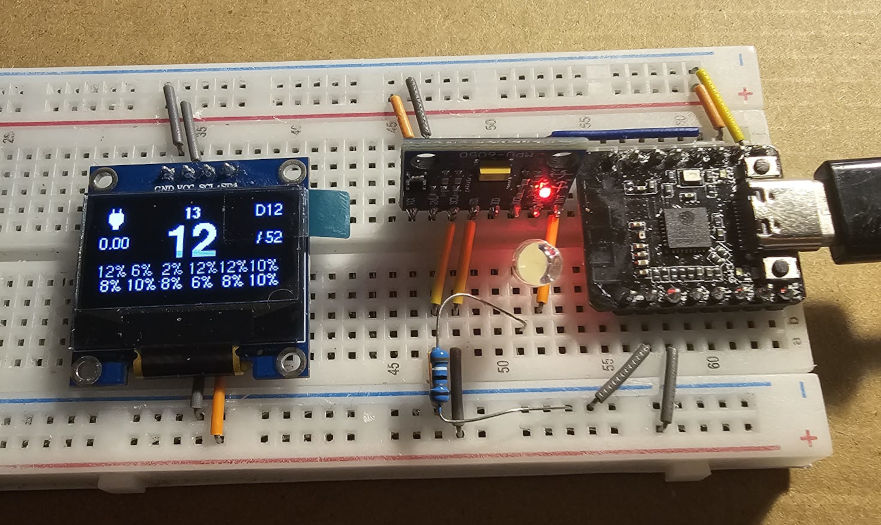

# Project D.I.C.E.: A Toit Digital Dice project, showcasing MEMS capabilities
'Dynamic Inertial Computing of Entropy': Rolling up entropy of motion.

## History
A short while ago I began a project to create a digital random number
generator/dice loaded with a choice of 'bad' randomness and 'good' randomness,
with the purpose of illustrating (to customers) the impact to a simple scenario
such as a well-known physical board game.  This began in Arduino - not being a
professional developer, I eventually got stuck in the complexities of managing
multithreading/multitasking on the platform.  The project stalled.  Since
discovering Toit, its virutal machines, task/scheduling, etc, I realised I
didn't have to solve those problems myself, or rely on complex libraries I
couldn't troubleshoot.  This is a small Toit reincarnation of that project -
with code and ideas robbed from it, minus the entropy/cryptography lesson, plus
a little polish - in an attempt to turn this into a complete product simple
enough for kids to use.



## About this project
This is a digital dice, which uses motion data generated by moving it to create
randomness for a dice roll. I've attempted to push the boundaries of what is
possible - the intention is not to have **any** other interfaces, eg, external
buttons.  Any/all interactions (even configuration choices) will be performed by
only by movement.  (Features have been used both to test and further refine
development of this [Toit MPU6050
driver/library](https://www.github.com/milkmansson/toit-mpu6050)
implementation.)

## How it is intended to work:
| Stage | Interaction | Behind the scenes | Implemented |
| - | - | - | - |
| 1 | Pick up the device to turn it 'On'. | Movement sense triggers interrupt waking ESP from deep sleep | Yes |
| 2 | Set it down so it learns which way is 'up' (the screen provides guidance). | Code examines movement and creates a calibration of 'up' | Yes |
| 3 | Screen Feedback | Provide constant feedback of things like battery and charge.  (Show roll distribution from before going to sleep). | Yes |
| 4 | Double-tap the table with the device to enter config menu. Tilt forward and backward to select options, like dice type, etc (interactions onscreen), tap it again to accept the choice. | Using calibration and tuned timing/wait states, save the options. Obtain initial selection from storage, and save selected options to storage for later use. | Not yet. Want to implement with DMP*, still writing this driver. |
| 5 | Double tap, or set the device down for 15s to exit config and use the selections. | Timer elapses, and selection (nim-roll/max-roll) selected | Not yet. Want to implement with DMP* but still working on this driver. |
| 6 | Shake the device, numbers adjust internally. | Whilst waiting for the device to be set down, continutally consume data from the sensor, and roll together | Yes |
| 7 | When set down, display the 'roll' (plus distribution data, for interest) | Use a mathematical function to reduce collected data into a selection.  Display distribution data, and optionally save the distribution data to RAM-backed storage. | Yes |
| 8 | Wait.  Do another roll when moved (goto 5). | Use zero-motion-to-motion detection on the sensor to determine if shaking or resting | Yes |
| 9 | After 120s, go to deep sleep (off).  | Using monotonic time, wait for a (configurable) timer to expire and run the ESP32 command. | Yes |

* **DMP:** (hardware-implemented) Digital Motion Processing.  This senses
  things like taps, step counting, and other things.  MEMs devices like the
  MPU6050 and others have this capability, but requires extra steps in the
  driver.  Without this, it would be up to this code to determine what
  movement was a shake, and what movement was a tap, for example.

## Worked examples/techniques in the source code
- Use of I2C throughout.
- Toit `pixel-display` driver and creating a display interface with both
  fixed and dynamic fields.
- Use of SSD1306 (via I2C).
- Use of MPU6050 (via I2C) and it's many features such as Motion Detection,
  and the use of the Gyroscope and Accelerometer.
- Task Scheduling on Toit.
- Interrupts via GPIO on ESP32/Toit.

## I want to build one!

### Parts Required/Prerequisites
This version was prototyped with parts on hand at the time.  Construction with
other hardware and drivers is totally possible, but may require some rework.
- **Toit** - The platform needs to be installed on your ESP32, follow the
  instructions found in Toit's [Getting Started](https://docs.toit.io/getstarted)
  guide.
- **ESP32** - I based this on the [DFRobot ESP32c6
  Beetle](https://wiki.dfrobot.com/SKU_DFR1117_Beetle_ESP32_C6) (v1.1) for the
  size constraints and (very) basic battery management built-in.)  Other Toit
  capable ESP32 modules will be compatible, however pin numbers may need to
  change.  See the guide below.
- **MPU6050** - I2C based motion sensing module.  (It could be argued that newer
  devices would be better choices, however this module is still cheaply
  available and good enough for this use case.  When I have other devices to
  hand, they can be incorporated!)
- **SSD1306** - Common and cheap I2C based OLED Screen.
- **LED** and resistor for indicating state (Optional).
- Connecting wires and other minor materials - if you are prototyping this, a
  good solderless breadboard, wires and other materials will be required.
- **Lipo battery** compatible with ESP32 board, and the expected device
  enclosure.  (Warning: polarity of the JST connector on commercial battery
  modules may not be the same as the JST connector on your ESP32 when
  they finally meet.)

### Wiring Diagram
When I get some time!  Pins and wiring can be seen in the code for now.  LED on
the interrupt line with a resistor can show when the interrupts are firing, but
is not necessary.

### Toit Module Dependencies
After cloning the repository, a `jag install` executed in the project directory
should install everything required.  (Full credit to their original authors!)
Toit packages required:
- [font_x11_adobe](https://github.com/toitlang/pkg-font-x11-adobe)
- [pixel_display](https://github.com/toitware/toit-pixel-display)
- [ssd1306](https://github.com/toitware/toit-ssd1306)
- [pictogrammers_icons](https://github.com/toitware/toit-icons-pictogrammers)
- [mpu6050](https://github.com/milkmansson/toit-mpu6050)
- [tp4057](https://github.com/milkmansson/toit-tp4057) - if you have one on your ESP32.  Otherwise some code changes for different SOC methods are required.


### Steps
1. Wire the project together.
2. Clone this repository, and get into the directory.
3. Reconcile pin changes etc with the section at the beginning of
   `project-dice.toit`
4. Run `jag install`
5. Try it out by running `jag run .\project-dice.toit
6. When happy, install as a container, starting with [this
   guide](https://docs.toit.io/tutorials/containers)


### Tuning
To assist with fine tuning, variables intended for modification are marked by
the section in the beginning of `project-dice`:
Dice Selection:
```
// Configure for a D12:
min-roll := 1
max-roll := 12

// Configure for a D6 (normal dice):
min-roll := 1
max-roll := 6
```
Movement Detection Thresholds:
```Toit
// MOVEMENT DETECTION: Suggested values 20–40mg, for 20–50ms.

// Force required to register motion.
// Bigger value = more movement required.
STILL-TO-MOTION-MG := 40

// Duration of that force required to register motion.
// Bigger value = movement required for longer.
STILL-TO-MOTION-MS := 5

// STILL DETECTION: Suggested values 5–10mg, for 600ms.

// Forces on the device need to be less than this many milli-g's.
MOTION-TO-STILL-MG := 10
// For at least this duration of milliseconds.
MOTION-TO-STILL-MS := 576
```
Other values:
```Toit
// Screen refreshes this often even if nothing is happening
SCREEN-REFRESH-DURATION := (Duration --ms=250)

// Distribution display refreshes this often (slower, less important)
DISTRIBUTION-REFRESH-DURATION := (Duration --ms=1000)

// Wait time before deep sleep
WAKE-DURATION := (Duration --s=20)

// WAKE-DURATION expiry is checked this often
CHECK-DURATION := (Duration --ms=500)

// If tp4057 loaded, battery display checked this often
BATTERY-DISPLAY-REFRESH := (Duration --s=30)

// If using DMP buffer, the buffer size display is refreshed this often
BUFFER-WATCHDOG-SLEEP-DURATION := (Duration --ms=100)

// Accelerometer movement magnitude minimum required to change the display value
MINIMUM-MAGNITUDE-TO-COUNT := 1.4
```

## To-Do list
- Get Toit Provisioning working for ESP32 for internet (and later dependent
  features)
- Provide a more interesting movement animation - perhaps a realtime plot/
  animation of force.
- Have generated data sent to an online destination, for better statistical
  analysis.  (Include integration with Toit BLE Wifi provisioning package.)
- Integrate an SRAM chip (like the 47L16) instead of flash for saving data, to
  help save flash lifetime when collecting roll distribution data, and the
  desire to save it every roll.
- Code integration with Artemis (use being optional) - for no other reason than
  to push myself and whats possible, including OTA firmware updates.
- Refine module selection - find a better ESP32 model with better battery
  management integrated.
- Experiment/integrate with other MEMS sensors, potentially implement AHRS, ftw.
  (If you are able to donate one, this would accelerate development!).

## Issues
If there are any issues, changes, or any other kind of feedback, please
[raise an issue](https://github.com/milkmansson/project-dice/issues). Feedback/
suggestions are welcome and appreciated!

## Disclaimer
- All trademarks belong to their respective owners.
- No warranties for this work, express or implied.

## Credits
- [This gist](https://gist.github.com/bloc97/b55f684d17edd8f50df8e918cbc00f94)
  which provided some inspiration some years ago.
- [Florian](https://github.com/floitsch) for the tireless help and encouragement
- The wider Toit developer team (past and present) for a truly excellent product
- AI has been used for code and text reviews, analysing and compiling data and
  results, and assisting with ensuring accuracy.  Its been a long time since
  high-school calculus, so I have leaned into AI to accelerate to teach me some
  old school maths!

## About Toit
One would assume you are here because you know what Toit is.  If you dont:
> Toit is a high-level, memory-safe language, with container/VM technology built
> specifically for microcontrollers (not a desktop language port). It gives fast
> iteration (live reloads over Wi-Fi in seconds), robust serviceability, and
> performance that’s far closer to C than typical scripting options on the
> ESP32. [[link](https://toitlang.org/)]
- [Review on Soracom](https://soracom.io/blog/internet-of-microcontrollers-made-easy-with-toit-x-soracom/)
- [Review on eeJournal](https://www.eejournal.com/article/its-time-to-get-toit)
